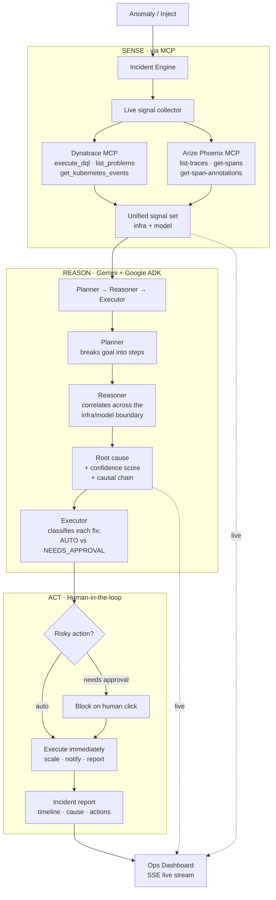
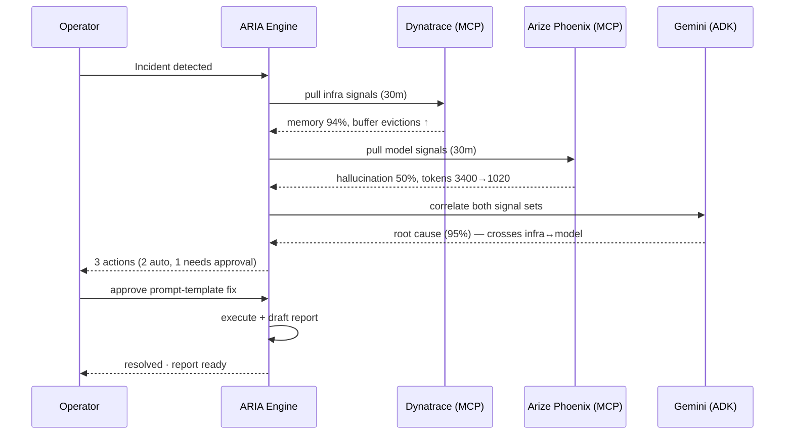
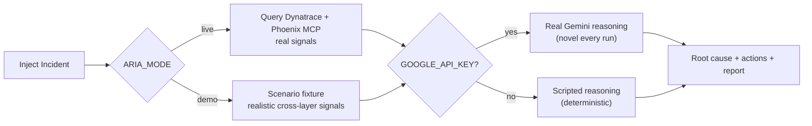

<div align="center">

# ARIA

[](LICENSE)
[](https://google.github.io/adk-docs/)
[](https://modelcontextprotocol.io)
[](https://rapid-agent.devpost.com/)

**Autonomous Reasoning & Incident Agent**

*One agent. It watches your infrastructure and your AI model at the same time — and finds the incidents that live in the gap between them.*

[Live demo](https://aria-three-lac.vercel.app/) · [3-min video](#) · [Source](https://github.com/Nidhicodes/aria)


</div>

---

## The thing nobody wants to say out loud

There's a clean story about AI observability: you instrument your model, you watch the
dashboards, and when quality drops you'll see it and fix it. Tools like
[Arize Phoenix](https://phoenix.arize.com) make the model side genuinely observable.
[Dynatrace](https://www.dynatrace.com) does the same for infrastructure. Both are excellent.

Here's the awkward part: **they don't talk to each other.** Your model lives in one tool,
your servers in another, watched by two different teams who page each other at 3am and spend
the first twenty minutes arguing about whose problem it is.

And the nastiest production incidents live *exactly* in that gap:

> A memory leak on a pod quietly forces the prompt-assembly buffer to evict context. The model
> starts receiving **truncated prompts**. With half its context gone, it hallucinates. The infra
> team sees "memory high." The ML team sees "model degraded." **Neither sees the causal chain
> connecting them** — because no human is watching both layers at once.

So there are two ways to close that gap:

1. Hope your infra team and ML team happen to be on the same call at the same time. (Good luck.)
2. Put one agent on top of both observability stacks that reasons across them automatically.

ARIA is option 2. It treats infrastructure signals and model signals as **one evidence set**,
because for the incidents that matter, they are. A memory spike and a hallucination spike that
happen in the same 30-minute window aren't two problems. They're usually one problem wearing
two costumes. Somebody just has to read both dashboards at once and connect them. That's the
whole trick.

---

## What it does, end to end

```
Anomaly fires (infra OR model)
   → ARIA pulls live context from BOTH Dynatrace and Arize Phoenix
   → Gemini reasons across the two signal sets, hunting for cross-layer causal chains
   → Names a single root cause with a confidence score
   → Plans the minimum set of fixes
   → Runs the safe ones automatically; pauses for a human click on the risky ones
   → Writes the incident report and closes the loop
```

The defining beat: **a single incident that touches both layers.** ARIA connects memory pressure
(Dynatrace) → prompt truncation → hallucination rate climbing (Arize) in seconds. No human would
have caught the link that fast.


---

## How it works



The key design choice is in **REASON**: the Reasoner agent carries *both* partner MCP toolsets at
once. A single Gemini reasoning loop can call a Dynatrace tool and an Arize tool in the same turn —
which is the only way cross-boundary correlation actually works. Hand the model two separate agents
and it never sees the connection. Give one agent both lenses and it does.

### The live incident, as a sequence



---

## What makes it hold together (not just demo)

A handful of engineering decisions are the difference between a slick demo and something real:

- **One agent, both lenses.** The cross-boundary insight only works because the Reasoner holds the
  Dynatrace *and* Arize MCP toolsets simultaneously. Two siloed agents reproduce the exact human
  blind spot we're trying to kill.
- **Real signals, computed live.** In live mode ARIA queries Phoenix for actual span data and
  computes hallucination rate, relevance, token counts, and latency from real traces — not a fixture.
  Different data → different numbers → different reasoning.
- **Streaming reasoning over SSE.** The dashboard shows the agent *thinking* — phase by phase,
  character by character — instead of a spinner and a final answer. Incident response is a live
  process; the UI treats it like one.
- **The approval gate is architectural, not cosmetic.** A `NEEDS_APPROVAL` action blocks on an
  `asyncio.Event` until a human calls `/approve`. The agent literally cannot execute a risky fix
  without you. That's the hackathon's "keep the human in control" requirement, enforced in code.
- **Graceful degradation, never a hard fail.** Live MCP → direct HTTP query → scripted fallback.
  If Gemini rate-limits or a token expires, ARIA still runs and still reasons. The product never
  shows the user a stack trace.
- **Confidence is a number, not a vibe.** Every root cause carries a 0–1 score and an explicit
  causal chain, so an operator can judge whether to trust it.

---

## Two minutes to your first incident

```bash
git clone https://github.com/Nidhicodes/aria
cd aria

# ── Backend ──
cd backend
uv venv && source .venv/bin/activate     # or python3 -m venv .venv
uv pip install -e .                        # add ".[adk]" for live MCP mode
cp ../.env.example .env                    # optional: add GOOGLE_API_KEY for real Gemini
uvicorn aria.server:app --port 8000

# ── Frontend (new terminal) ──
cd ../frontend
npm install
npm run dev                                # http://localhost:3000
```

Open the dashboard, hit **⚡ Inject Incident**, and watch ARIA wake up. Zero credentials needed —
it runs in demo mode out of the box, and lights up fully when you add keys.

---

## Demo vs Live: same agent, different lenses

ARIA runs the **identical pipeline** either way. The only thing that changes is where signals come
from and what drives reasoning:

| | Demo (default) | Live |
|---|---|---|
| Infra signals | synthetic scenario | **Dynatrace MCP**, queried live |
| Model signals | synthetic scenario | **Arize Phoenix MCP**, computed from real traces |
| Reasoning | real Gemini if keyed, else scripted | Gemini via Google ADK, both MCP toolsets attached |
| Setup | nothing | `.env` + `ARIA_MODE=live` |

Demo mode exists so the project always runs — for the video, for a clone, for a judge with no
accounts. Live mode is the real thing. Flip one env var; nothing else changes.

### Enabling live mode

```bash
# Install the ADK extra (adds google-adk + mcp)
pip install -e ".[adk]"

# Ensure Node >= 22 is on PATH (MCP servers run via npx)
node --version
```

Fill `backend/.env`:
```ini
ARIA_MODE=live
GOOGLE_API_KEY=...                    # https://aistudio.google.com/apikey (free tier)
ARIA_MODEL=gemini-2.5-flash           # 30 RPM free; or gemini-3-pro-preview with billing
DT_ENVIRONMENT=https://xxx.apps.dynatrace.com
DT_PLATFORM_TOKEN=                    # leave empty → browser OAuth (local dev)
PHOENIX_HOST=http://localhost:6006    # local Phoenix, or https://app.phoenix.arize.com
PHOENIX_API_KEY=                      # only needed for Phoenix Cloud
```

Start Phoenix locally (free, no account needed):
```bash
pip install arize-phoenix
phoenix serve --port 6006
python scripts/seed_phoenix.py        # seeds 40 real LLM traces
```

Then restart the backend. `GET /api/health` confirms which integrations are live.



---

## The reasoning chain is the product

Everything else — the typography, the living background, the confidence gauge — exists to make one
thing land: **watching ARIA reason should feel like having a calm, sharp colleague think out loud
under pressure.**


The chain renders phase by phase — `PULLING → CORRELATING → CONCLUSION` — typing character by
character with a blinking cursor, because incident response *is* a thought process and the UI
should show it as one. The `CONCLUSION` line is styled differently and the confidence score counts
up from gray to its final color. When it lands on "this crosses the infra↔model boundary," that's
the moment that no single-vendor dashboard can give you.

---

## Where ARIA fits

| Tool | What it watches | The blind spot |
|---|---|---|
| Dynatrace | infrastructure | doesn't see model quality |
| Arize Phoenix | model quality | doesn't see infrastructure |
| Datadog AI Monitoring | both, as separate dashboards | no automated correlation *between* them |
| A human on-call | whatever they pull up | can't watch both layers at 3am, fast |
| **ARIA** | **both, as one evidence set** | **— that's the point** |

The gap it fills: automated, cross-layer root-cause reasoning that no single observability vendor
provides today, with a human gate on every risky action.

---

## Tech stack

| Layer | Choice | Why |
|---|---|---|
| Agent orchestration | **Google ADK** (Agent Builder) | Planner→Reasoner→Executor, MCP-native |
| Reasoning | **Gemini** (`gemini-2.5-flash` / `gemini-3-pro`) | strong cross-signal reasoning, configurable |
| AI observability | **Arize Phoenix MCP** | real LLM traces, evals, hallucination scores |
| Infra observability | **Dynatrace MCP** | metrics, problems, k8s events, DQL |
| Backend | **Python · FastAPI · SSE** | lightweight, streaming-native |
| Frontend | **Next.js · React · Tailwind** | the ops dashboard |
| Deploy | **Render (API) · Vercel (UI)** | both on free tiers, live today |

---

## Repository layout

```
aria/
├── backend/
│   └── aria/
│       ├── agents/        Planner · Reasoner · Executor (ADK) + live runner
│       ├── tools/         MCP toolsets · live signal fetcher · scenarios · remediation
│       ├── prompts.py     the cross-signal correlation prompt — the core IP
│       ├── engine.py      incident lifecycle state machine + SSE stream
│       ├── incident.py    signal / reasoning / action / incident models
│       └── server.py      FastAPI: inject · stream · approve · reject
├── frontend/
│   └── src/
│       ├── app/           landing · dashboard (overview · incident · config)
│       ├── components/    reasoning chain · oracles · action cards · flow field
│       └── lib/           SSE client · incident store · types
├── scripts/               seed_phoenix.py · seed_dynatrace.py
└── LICENSE                Apache-2.0
```

---

## Use it as a service

The backend is plain HTTP + SSE — any platform can drive it, no coupling to our frontend:

```
POST /api/incidents/inject                          → start an investigation
GET  /api/incidents/{id}/stream                     → SSE: phase · signal · reasoning · root_cause · action · report · done
POST /api/incidents/{id}/actions/{actionId}/approve → human-in-the-loop gate
POST /api/incidents/{id}/actions/{actionId}/reject
GET  /api/health                                    → which integrations are live
```

Embed ARIA's pipeline in your own agent platform by importing `build_root_agent(settings)` and
mounting the Planner/Reasoner/Executor as ADK sub-agents, or expose it over A2A. Add your own
`McpToolset` entries (PagerDuty, GitHub, internal MCP servers) to `build_all_toolsets` — the
correlation prompt is tool-agnostic.

### Making remediation real

`execute_action` in `aria/tools/remediation.py` is the single choke-point. Map action titles to
real tool calls:
- **Notify** → Dynatrace `send_slack_message` or `send_email`
- **Scale** → your deploy webhook or kubectl command
- **Rollback** → CI trigger

Destructive actions stay behind the `NEEDS_APPROVAL` gate — the operator must click before they run.

### Deployment

The hosted demo uses:
- **Backend**: [Render.com](https://render.com) free tier → `pip install .` + `uvicorn aria.server:app`
- **Frontend**: [Vercel](https://vercel.com) free tier → root directory `frontend`, env var `NEXT_PUBLIC_ARIA_API`

For production: Cloud Run with service-account tokens (no browser OAuth), both partner MCP servers
running headlessly with platform tokens.

---

## The honest part

A few things stated plainly, because hand-wavy demos are worse than honest ones:

- **Remediation is simulated by default.** A hackathon demo should never actually roll back your
  production. `execute_action` is the single choke-point to wire to real tools (`send_event`,
  `send_slack_message`, your deploy webhook) — kept behind the approval gate.
- **The hosted demo runs in demo mode.** Browser-OAuth and a local Phoenix don't fit a headless
  free-tier container. The reasoning is real Gemini; the signals are the scenario fixture. The
  *video* shows the full live integration against real Dynatrace + real Phoenix traces.
- **Dynatrace live reads depend on your environment having data.** A fresh trial may legitimately
  report "no active problems" — which is ARIA correctly telling you your infra is healthy.

---

## Requirements

- Python 3.10+, Node 18+
- For real reasoning: a Gemini API key ([free tier](https://aistudio.google.com/apikey))
- For live mode: `pip install -e ".[adk]"`, Node 22+ (MCP servers run via `npx`), and Dynatrace +
  Arize Phoenix credentials

## License

Apache-2.0 — see [LICENSE](LICENSE).

<div align="center">

*ARIA doesn't replace your on-call engineer. It gives them a colleague who never sleeps,
reasons clearly under pressure, and always shows its work.*

</div>
